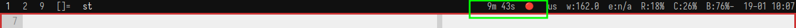

# C Scripts

I had these scripts in bash, replaced them with C just for fun.

## Build

Just run:

```
make
```

## session

Session helps me keep focus for N amount of time. Usage is like this:

```
session &
session 20m
```

It uses two files under /tmp:

```
/tmp/.session_start
/tmp/.session_state
```

Running `session` without args will cause it to look for the `session_start`
file and update the `session_state` file if there's a current session.

To start a session, run `session 20m` for example, the session program will
write the amount of seconds to `session_start`, and the `session` "daemon" will
parse those seconds and write the remaining time of the session to
`session_state`. Then, I `cat` the file into my status bar `slstatus` so I can
see how long till the end of the session. Looks something like:


